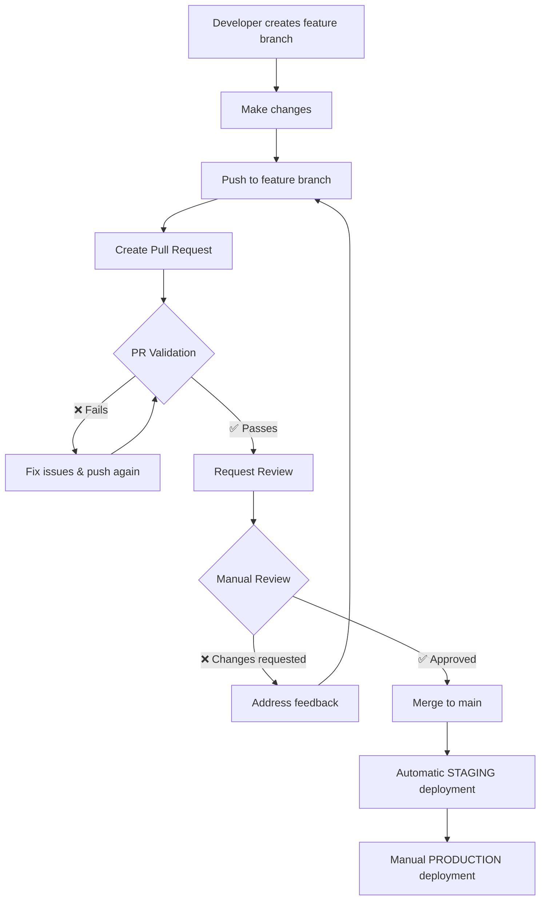

# 🔐 Branch Protection Setup Guide

This guide shows you how to set up **branch protection rules** to prevent direct commits to main and enforce the Pull Request workflow.

## 🎯 What This Accomplishes

✅ **No direct commits to main branch**  
✅ **All changes require Pull Request approval**  
✅ **Automated testing before merge**  
✅ **Manual review process**  
✅ **Conflict detection**  
✅ **Security scanning**  

## 🚀 Quick Setup (GitHub Web Interface)

### Step 1: Navigate to Branch Protection

1. Go to your GitHub repository
2. Click **Settings** tab
3. Click **Branches** in the left sidebar
4. Click **Add rule** next to "Branch protection rules"

### Step 2: Configure Protection Rule

**Branch name pattern:** `main`

**Protect matching branches - Enable these settings:**

```
☑️ Restrict pushes that create files
☑️ Require a pull request before merging
   ☑️ Require approvals (set to 1)
   ☑️ Dismiss stale PR approvals when new commits are pushed
   ☑️ Require review from code owners
   ☑️ Restrict pushes that create files to code owners
   
☑️ Require status checks to pass before merging
   ☑️ Require branches to be up to date before merging
   
   Required status checks:
   - Validate Pull Request / validate-pr
   - Validate Pull Request / security-scan
   
☑️ Require conversation resolution before merging
☑️ Require signed commits
☑️ Require linear history
☑️ Include administrators
```

### Step 3: Verify Setup

1. Try to push directly to main → Should be **blocked**
2. Create a feature branch → Should **work**
3. Open a PR from feature branch → Should **trigger validation**
4. Merge PR after approval → Should **trigger deployment**

## 🔧 CLI Setup (Alternative)

You can also set this up via GitHub CLI:

```bash
# Install GitHub CLI if needed
brew install gh

# Authenticate
gh auth login

# Create branch protection rule
gh api repos/:owner/:repo/branches/main/protection \
  --method PUT \
  --field required_status_checks='{"strict":true,"contexts":["Validate Pull Request / validate-pr","Validate Pull Request / security-scan"]}' \
  --field enforce_admins=true \
  --field required_pull_request_reviews='{"required_approving_review_count":1,"dismiss_stale_reviews":true,"require_code_owner_reviews":true}' \
  --field restrictions=null
```

## 🛡️ Security Workflow Overview

### The Complete Flow:



### What Gets Checked in PR Validation:

1. **Code Quality**
   - Formatting (black)
   - Linting (flake8)
   - Unit tests
   - Local function tests

2. **Security**
   - Secret scanning
   - Vulnerability scanning
   - Permission checks

3. **Structure**
   - Required files/directories
   - Merge conflict detection
   - Deployment script validation

## 📋 Developer Workflow

### Creating a New Feature:

```bash
# 1. Start from main
git checkout main
git pull origin main

# 2. Create feature branch
git checkout -b feature/my-new-lambda

# 3. Make changes
# ... edit files ...

# 4. Commit and push
git add .
git commit -m "Add new Lambda function"
git push origin feature/my-new-lambda

# 5. Create PR via GitHub web interface or CLI
gh pr create --title "Add new Lambda function" --body "Description of changes"

# 6. Wait for validation ✅
# 7. Request review 👥
# 8. Merge after approval ✅
```

### Emergency Hotfixes:

```bash
# 1. Create hotfix branch from main
git checkout main
git pull origin main
git checkout -b hotfix/critical-bug-fix

# 2. Make minimal fix
# ... fix the bug ...

# 3. Fast-track PR with priority review
git add .
git commit -m "HOTFIX: Critical bug fix"
git push origin hotfix/critical-bug-fix
gh pr create --title "HOTFIX: Critical bug fix" --body "Emergency fix for production issue"

# 4. Request immediate review
# 5. Merge and deploy ASAP
```

## 🎖️ Best Practices

### ✅ DO:
- Use descriptive branch names (`feature/auth-handler`, `fix/deployment-error`)
- Write clear commit messages
- Keep PRs focused and small
- Add tests for new functions
- Update documentation when needed
- Respond to PR feedback promptly

### ❌ DON'T:
- Try to push directly to main (it's blocked anyway)
- Create massive PRs with multiple features
- Skip writing tests
- Ignore linting/formatting errors
- Merge your own PRs without review

## 🚨 Troubleshooting

### "Branch protection rules block this push"
- **Solution**: Create a feature branch and open a PR

### "Required status checks have not passed"
- **Solution**: Check the Actions tab for test failures and fix them

### "Pull request is out of date"
- **Solution**: Update your branch with main:
  ```bash
  git checkout main
  git pull origin main
  git checkout your-feature-branch
  git merge main
  git push origin your-feature-branch
  ```

### "Merge conflicts detected"
- **Solution**: Resolve conflicts locally:
  ```bash
  git checkout main
  git pull origin main
  git checkout your-feature-branch
  git merge main
  # Fix conflicts in your editor
  git add .
  git commit -m "Resolve merge conflicts"
  git push origin your-feature-branch
  ```

## 🔗 Related Documentation

- [GitHub Actions Setup](SETUP.md)
- [Main README](../README.md)
- [Rollback Procedures](../README.md#rollback-procedures)

---

**🎯 Result: Your main branch is now bulletproof!** 🛡️
